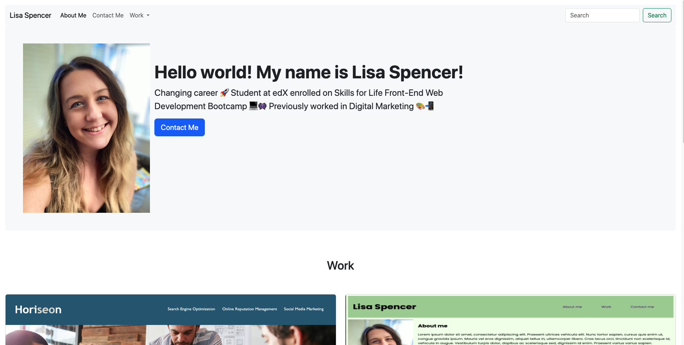

# Week 3 Challenge: Build Portfolio with Bootstrap

## Project status
Finished acceptance criteria for Module 3 -  ran out of time to finish this project the way I would like

## Name
Lisa Spencer: Developer Portfolio [Bootstrap Edition]

## Description
This page is the challenge/homework for Week 3 of my Bootcamp course. The aim is to showcase my projects as a developer in the form of a website using Bootstrap for most of the elements. There is use of HTML, CSS and Bootstrap within this website. 

## Link to deployed application
https://lisaspencer1997.github.io/Bootstrap-Portfolio/

## Screenshot

## Support
Contact me on lisa-spencer@outlook.com if something is not working as intended.

## Authors and acknowledgment
* https://getbootstrap.com/docs/5.3/components/card/
* https://stackoverflow.com/questions/22000754/responsive-bootstrap-jumbotron-background-image
* https://getbootstrap.com/docs/5.3/examples/

## License
This is licenced through MIT. 
